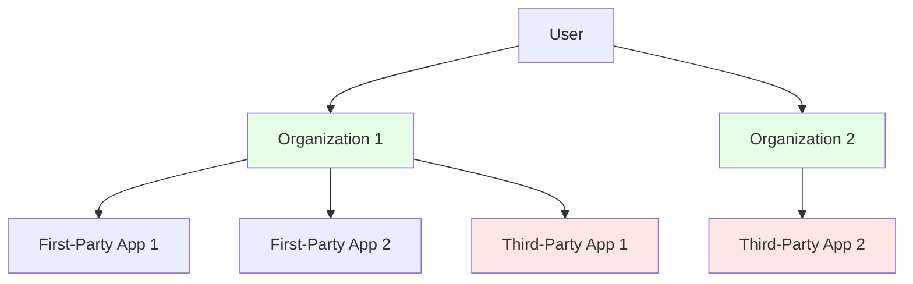
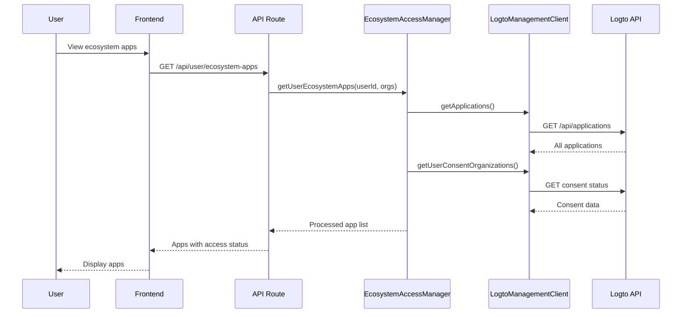
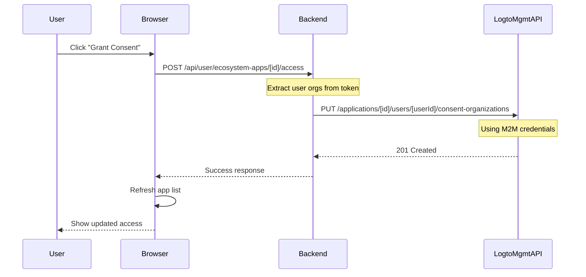
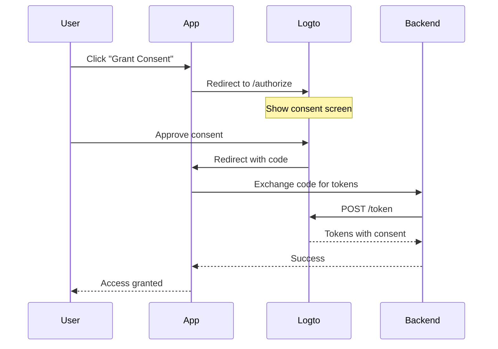

# Ecosystem Authentication Architecture

## Table of Contents
1. [Overview](#overview)
2. [Core Concepts](#core-concepts)
3. [Implementation Architecture](#implementation-architecture)
4. [Application Access Patterns](#application-access-patterns)
5. [Current Implementation Details](#current-implementation-details)
6. [API Flow Diagrams](#api-flow-diagrams)
7. [Known Limitations](#known-limitations)
8. [Future Development Path](#future-development-path)
9. [Migration Strategy](#migration-strategy)

## Overview

The Ecosystem Authentication system provides a centralized way for users to manage access to applications across the platform. It leverages Logto's organization-based multi-tenancy to handle both first-party and third-party application access control.

### Key Features
- **Unified Application Management**: Single dashboard for all ecosystem applications
- **Organization-Based Access**: Access control tied to organization membership
- **Consent Management**: Grant/revoke consent for third-party applications
- **Automatic Access**: First-party apps accessible to organization members

## Core Concepts

### Application Types in Logto

#### 1. First-Party Applications
- **Definition**: Applications owned and operated by the platform
- **Access Model**: Automatic access for organization members
- **Examples**: `ecosystem-platform`, `fumadocs`, `app-store`
- **Key Characteristic**: `isThirdParty: false` in Logto

#### 2. Third-Party Applications
- **Definition**: External applications requiring explicit user consent
- **Access Model**: OAuth-style consent required per organization
- **Examples**: `Demo CRM`, `Demo Analytics`
- **Key Characteristic**: `isThirdParty: true` in Logto

#### 3. Machine-to-Machine (M2M) Applications
- **Definition**: Service accounts for backend operations
- **Access Model**: Client credentials flow with API resources
- **Examples**: `service-account-api`, `fumadocs-m2m`
- **Usage**: Backend API access, Management API operations

### Organization Context



### User Token Claims

```javascript
// ID Token Claims Structure
{
  sub: "pa9i7mvzpxo4",                    // User ID
  email: "demo@user.com",
  organizations: ["lw9zzloe3d5a"],        // User's organizations
  organization_roles: {
    "lw9zzloe3d5a": ["member"]            // Roles per organization
  }
}
```

## Implementation Architecture

### Component Hierarchy

```
ecosystem-auth/
├── lib/auth/
│   ├── logto-management-client.ts      # M2M API client
│   ├── ecosystem-access-manager.ts     # Business logic
│   └── cache-manager.ts                # Performance optimization
├── app/api/user/
│   ├── ecosystem-apps/
│   │   ├── route.ts                    # GET user apps
│   │   └── [id]/access/route.ts        # POST grant/revoke
│   └── organizations/route.ts          # GET user orgs
└── app/profile/
    └── ecosystem-apps/page.tsx         # UI component
```

### Data Flow



## Application Access Patterns

### First-Party Application Access Logic

```javascript
// Pseudocode for first-party app access determination
function checkFirstPartyAccess(app, user) {
  // 1. Platform apps always accessible
  if (app.name.includes('ecosystem') || app.name.includes('platform')) {
    return { hasAccess: true, reason: 'Platform Access' }
  }
  
  // 2. Check if app is in user's organizations
  for (const orgId of user.organizations) {
    const orgApps = getOrganizationApplications(orgId)
    if (orgApps.includes(app.id)) {
      return { hasAccess: true, reason: 'Organization Member' }
    }
  }
  
  // 3. Standalone apps accessible to any org member
  if (user.organizations.length > 0) {
    return { hasAccess: true, reason: 'Member Access' }
  }
  
  return { hasAccess: false, reason: 'No Access' }
}
```

### Third-Party Application Consent Flow

```javascript
// Current Implementation (M2M Programmatic)
async function grantThirdPartyConsent(appId, userId, userOrgs) {
  // Direct API call using M2M credentials
  await logtoManagementClient.grantUserConsentOrganizations(
    appId,
    userId,
    userOrgs
  )
  // Result: Consent granted without user interaction
}

// Ideal Implementation (OAuth User Flow)
function initiateOAuthConsent(appId, orgId) {
  // Redirect to Logto consent page
  window.location.href = buildConsentUrl({
    client_id: appId,
    organization_id: orgId,
    scope: 'openid profile email organizations',
    redirect_uri: `${window.location.origin}/consent/callback`
  })
  // Result: User sees consent screen and explicitly approves
}
```

## Current Implementation Details

### Access States

| Application Type | Organization Member | Access State | UI Display |
|-----------------|---------------------|--------------|------------|
| Platform Apps | Yes | Always Active | "Platform Access" |
| First-Party (in org) | Yes | Active | "Organization Member" |
| First-Party (standalone) | Yes | Active | "Member Access" |
| First-Party | No | Inactive | "Request Access" |
| Third-Party (consented) | Yes | Active | "Revoke Consent" |
| Third-Party | Yes | Inactive | "Grant Consent" |
| Third-Party | No | Inactive | "Grant Consent" |

### Caching Strategy

```javascript
// Cache keys and TTL
const cacheConfig = {
  userApps: {
    key: `user:${userId}:ecosystem-apps`,
    ttl: 300 // 5 minutes
  },
  accessToken: {
    key: 'logto:m2m:token',
    ttl: 3600 // 1 hour
  }
}
```

### API Endpoints

#### GET /api/user/ecosystem-apps
```javascript
// Response structure
{
  apps: [
    {
      id: "app-id",
      name: "App Name",
      description: "Description",
      url: "https://app.example.com",
      organizationId: "org-id",
      organizationName: "ACME Corporation",
      hasAccess: true,
      lastAccessed: "2024-01-15T10:30:00Z",
      permissions: ["read:data", "write:data"],
      appType: "first-party" | "third-party",
      logtoType: "Traditional" | "SPA" | "Native"
    }
  ],
  totalCount: 9,
  activeCount: 7,
  organizationCount: 1
}
```

#### POST /api/user/ecosystem-apps/[id]/access
```javascript
// Request
{
  action: "grant" | "revoke"
}

// Response
{
  success: true,
  action: "grant",
  applicationId: "app-id"
}
```

## API Flow Diagrams

### Grant Consent Flow (Current M2M Implementation)



### Ideal OAuth Consent Flow (Future)



## Known Limitations

### Current Implementation Issues

1. **No User Consent UI**
   - Third-party consent granted programmatically via M2M
   - Users don't see what permissions they're granting
   - No ability to selectively grant permissions

2. **First-Party Access Not Persistent**
   - "Request Access" for standalone apps doesn't persist
   - Access determined dynamically based on org membership
   - No audit trail for access requests

3. **Organization Association Gaps**
   - Many first-party apps not associated with organizations
   - No clear way to add apps to organizations via UI
   - M2M apps showing in user-facing lists

4. **Cache Invalidation**
   - 5-minute cache can show stale data
   - Manual refresh required after access changes
   - No real-time updates

## Future Development Path

### Phase 1: Implement Proper OAuth Consent Flow

```typescript
// New consent initiation endpoint
app.post('/api/consent/initiate', async (req, res) => {
  const { applicationId, organizationId } = req.body
  
  // Generate state for CSRF protection
  const state = generateSecureState()
  await storeState(state, { applicationId, organizationId, userId })
  
  // Build Logto consent URL
  const consentUrl = new URL(`${LOGTO_ENDPOINT}/consent`)
  consentUrl.searchParams.append('client_id', applicationId)
  consentUrl.searchParams.append('organization_id', organizationId)
  consentUrl.searchParams.append('redirect_uri', `${BASE_URL}/api/consent/callback`)
  consentUrl.searchParams.append('state', state)
  consentUrl.searchParams.append('scope', 'openid profile organizations')
  
  res.json({ consentUrl: consentUrl.toString() })
})

// Consent callback handler
app.get('/api/consent/callback', async (req, res) => {
  const { code, state } = req.query
  
  // Validate state
  const sessionData = await validateState(state)
  if (!sessionData) {
    return res.status(400).json({ error: 'Invalid state' })
  }
  
  // Exchange code for consent confirmation
  const consent = await exchangeCodeForConsent(code)
  
  // Store consent record
  await storeUserConsent(sessionData.userId, sessionData.applicationId, consent)
  
  // Redirect back to app
  res.redirect('/profile/ecosystem-apps?consent=granted')
})
```

### Phase 2: Implement Application Request System

```typescript
interface ApplicationAccessRequest {
  id: string
  userId: string
  applicationId: string
  organizationId: string
  status: 'pending' | 'approved' | 'rejected'
  requestedAt: Date
  reviewedAt?: Date
  reviewedBy?: string
  justification?: string
}

// Request access for first-party apps
async function requestApplicationAccess(
  userId: string,
  applicationId: string,
  justification?: string
): Promise<ApplicationAccessRequest> {
  const request = {
    id: generateId(),
    userId,
    applicationId,
    organizationId: getUserPrimaryOrganization(userId),
    status: 'pending',
    requestedAt: new Date(),
    justification
  }
  
  await db.accessRequests.create(request)
  await notifyOrganizationAdmins(request)
  
  return request
}
```

### Phase 3: Enhanced Organization Management

```typescript
// Add application to organization
async function addApplicationToOrganization(
  applicationId: string,
  organizationId: string,
  roles?: string[]
): Promise<void> {
  // Add app to organization
  await logtoManagementClient.addOrganizationApplication(
    organizationId,
    applicationId
  )
  
  // Assign default roles if specified
  if (roles?.length) {
    await logtoManagementClient.assignApplicationRoles(
      organizationId,
      applicationId,
      roles
    )
  }
}

// Bulk manage organization applications
async function syncOrganizationApplications(
  organizationId: string,
  applicationIds: string[]
): Promise<void> {
  const currentApps = await getOrganizationApplications(organizationId)
  
  const toAdd = applicationIds.filter(id => !currentApps.includes(id))
  const toRemove = currentApps.filter(id => !applicationIds.includes(id))
  
  await Promise.all([
    ...toAdd.map(id => addApplicationToOrganization(id, organizationId)),
    ...toRemove.map(id => removeApplicationFromOrganization(id, organizationId))
  ])
}
```

### Phase 4: Real-time Updates

```typescript
// WebSocket for real-time access updates
io.on('connection', (socket) => {
  socket.on('subscribe:ecosystem-apps', async (userId) => {
    // Join user-specific room
    socket.join(`user:${userId}:apps`)
    
    // Send initial state
    const apps = await ecosystemAccessManager.getUserEcosystemApps(userId)
    socket.emit('ecosystem-apps:update', apps)
  })
})

// Broadcast updates when access changes
async function broadcastAccessChange(userId: string, applicationId: string) {
  const updatedApps = await ecosystemAccessManager.getUserEcosystemApps(userId)
  io.to(`user:${userId}:apps`).emit('ecosystem-apps:update', updatedApps)
}
```

## Migration Strategy

### Step 1: Data Migration
```sql
-- Create access records for existing consents
INSERT INTO application_access_records (user_id, application_id, granted_at, granted_via)
SELECT 
  uco.user_id,
  uco.application_id,
  uco.created_at,
  'migration_m2m'
FROM user_consent_organizations uco;
```

### Step 2: Feature Flags
```javascript
const features = {
  useOAuthConsent: process.env.FEATURE_OAUTH_CONSENT === 'true',
  showAccessRequests: process.env.FEATURE_ACCESS_REQUESTS === 'true',
  realtimeUpdates: process.env.FEATURE_REALTIME_UPDATES === 'true'
}
```

### Step 3: Gradual Rollout
1. Enable OAuth consent for new third-party apps
2. Migrate existing third-party apps to OAuth flow
3. Implement access request system for first-party apps
4. Enable real-time updates for pilot users
5. Full rollout with deprecation of M2M consent

## Security Considerations

### CSRF Protection
```javascript
// Generate and validate state parameter
function generateState(): string {
  return crypto.randomBytes(32).toString('hex')
}

async function validateState(state: string): Promise<boolean> {
  const stored = await cache.get(`state:${state}`)
  if (!stored) return false
  
  await cache.delete(`state:${state}`)
  return true
}
```

### Token Security
```javascript
// Secure token storage
const tokenStorage = {
  store: async (token: string, userId: string) => {
    const encrypted = await encrypt(token, process.env.ENCRYPTION_KEY)
    await cache.set(`token:${userId}`, encrypted, 3600)
  },
  
  retrieve: async (userId: string): Promise<string | null> => {
    const encrypted = await cache.get(`token:${userId}`)
    if (!encrypted) return null
    
    return decrypt(encrypted, process.env.ENCRYPTION_KEY)
  }
}
```

### Rate Limiting
```javascript
const rateLimiter = {
  consent: rateLimit({
    windowMs: 15 * 60 * 1000, // 15 minutes
    max: 5 // 5 consent requests per window
  }),
  
  accessRequest: rateLimit({
    windowMs: 60 * 60 * 1000, // 1 hour
    max: 10 // 10 access requests per hour
  })
}
```

## Monitoring and Analytics

### Key Metrics
```javascript
const metrics = {
  // Access patterns
  totalApplications: 'ecosystem.apps.total',
  activeApplications: 'ecosystem.apps.active',
  consentGrants: 'ecosystem.consent.grants',
  consentRevokes: 'ecosystem.consent.revokes',
  
  // Performance
  apiLatency: 'ecosystem.api.latency',
  cacheHitRate: 'ecosystem.cache.hit_rate',
  
  // Errors
  authFailures: 'ecosystem.auth.failures',
  apiErrors: 'ecosystem.api.errors'
}
```

### Logging Strategy
```javascript
const logger = {
  accessGranted: (userId: string, appId: string) => {
    log.info('Access granted', {
      userId,
      applicationId: appId,
      timestamp: new Date(),
      event: 'ACCESS_GRANTED'
    })
  },
  
  consentUpdated: (userId: string, appId: string, action: string) => {
    log.info('Consent updated', {
      userId,
      applicationId: appId,
      action,
      timestamp: new Date(),
      event: 'CONSENT_UPDATED'
    })
  }
}
```

## Conclusion

The Ecosystem Authentication system provides a robust foundation for managing application access across the platform. While the current implementation uses M2M credentials for simplicity, the architecture supports evolution toward a full OAuth consent flow with proper user interaction.

Key achievements:
- ✅ Unified application management interface
- ✅ Organization-based access control
- ✅ Support for both first-party and third-party apps
- ✅ Efficient caching and performance optimization

Future improvements will focus on:
- 🔄 Implementing proper OAuth consent flow
- 🔄 Adding access request workflow
- 🔄 Real-time updates and notifications
- 🔄 Enhanced audit logging and compliance

This architecture ensures scalability, security, and user control while maintaining backward compatibility with existing Logto infrastructure.