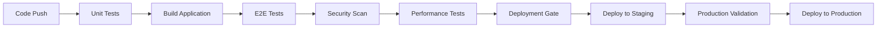

# CI/CD Operations Guide

## Overview

This guide covers the Continuous Integration and Continuous Deployment pipeline for the Net Ecosystem Platform, with a focus on authentication testing and validation.

## Pipeline Architecture

### GitHub Actions Workflows

#### Authentication Tests Workflow (`.github/workflows/authentication-tests.yml`)

**Triggers:**
- Push to `main` or `develop` branches
- Pull requests to `main` or `develop`
- Daily scheduled runs (2 AM UTC)

**Jobs:**
1. **Unit Tests** - Jest tests with coverage
2. **E2E Tests** - Playwright browser testing
3. **Security Scan** - Dependency and security audit
4. **Performance Tests** - Lighthouse performance validation
5. **Deployment Gate** - Final validation before deployment
6. **Notifications** - Result reporting and alerts

### Pipeline Stages



## Configuration

### Required Secrets

Configure these in GitHub repository settings:

**Authentication:**
- `LOGTO_ENDPOINT` - Logto instance URL
- `LOGTO_APP_ID` - Test application ID
- `LOGTO_APP_SECRET` - Test application secret
- `LOGTO_RESOURCE_ID` - API resource identifier

**Monitoring & Alerts:**
- `SLACK_CRITICAL_WEBHOOK` - Critical alerts Slack webhook
- `SLACK_ALERTS_WEBHOOK` - General alerts Slack webhook
- `CODECOV_TOKEN` - Code coverage reporting
- `LHCI_GITHUB_APP_TOKEN` - Lighthouse CI integration

**Optional:**
- `PAGERDUTY_INTEGRATION_KEY` - PagerDuty integration
- `ALERT_EMAIL_FROM` - Alert sender email
- `ALERT_EMAIL_TO` - Alert recipient email

### Environment Variables

**CI Environment:**
```bash
NODE_ENV=test
CI=true
PORT=6789
PLAYWRIGHT_BASE_URL=http://localhost:6789
```

## Testing Strategy

### Unit Tests (Jest)

**Location:** `lib/auth/__tests__/`
**Configuration:** `jest.config.js`
**Coverage Target:** 90% (branches, functions, lines, statements)

**Key Tests:**
- JWT validation and parsing
- Organization context building
- Permission checking logic
- Token expiration handling
- Error boundary testing

**Running Locally:**
```bash
# Run all unit tests
pnpm test

# Run with coverage
pnpm test:coverage

# Watch mode for development
pnpm test:watch
```

### E2E Tests (Playwright)

**Location:** `tests/e2e/`
**Configuration:** `playwright.config.ts`
**Browsers:** Chrome, Firefox, Safari, Mobile Chrome

**Key Flows:**
- Authentication redirect to Logto
- Callback handling and token processing
- Organization switching
- Logout functionality
- Error handling

**Running Locally:**
```bash
# Install browsers
pnpm exec playwright install

# Run E2E tests
pnpm test:e2e

# Run with UI mode
pnpm test:e2e:ui
```

### Production Readiness Tests

**Location:** `tests/staging/`
**Purpose:** Validate production-like environment

**Checks:**
- Health endpoint validation
- Performance baselines
- Security headers
- Accessibility standards
- Error handling
- Concurrent user support

## Deployment Gates

### Conditions for Deployment Approval

**Must Pass:**
- All unit tests passing (100%)
- E2E tests passing (100%)
- Security scan with no critical issues
- Code coverage above 90%

**Warning Conditions (Deploy with Caution):**
- Performance regression > 10%
- New dependencies with moderate vulnerabilities
- Test flakiness > 5%

**Blocking Conditions:**
- Critical security vulnerabilities
- Authentication flow failures
- Health endpoint failures
- Build failures

### Manual Override Process

**When to Override:**
- Emergency hotfixes
- Non-auth related changes
- Test infrastructure issues

**Process:**
1. Create override issue with justification
2. Get approval from tech lead
3. Document risks and mitigation
4. Deploy with enhanced monitoring
5. Schedule follow-up remediation

## Monitoring and Alerting

### Pipeline Monitoring

**Metrics Tracked:**
- Build success rate
- Test execution time
- Deployment frequency
- Mean time to recovery (MTTR)
- Change failure rate

**Alerts:**
- Build failures → Slack + Email
- Test flakiness > 10% → Weekly report
- Deployment failures → PagerDuty
- Security issues → Immediate notification

### Post-Deployment Monitoring

**Health Checks:**
- Application health endpoint
- Authentication flow validation
- Performance baseline verification
- Error rate monitoring

**Rollback Triggers:**
- Health endpoint failure > 2 minutes
- Error rate > 5% increase
- Performance degradation > 25%
- User reports of auth failures

## Troubleshooting

### Common CI/CD Issues

#### 1. Unit Tests Failing

**Diagnosis:**
```bash
# Check test output in GitHub Actions
# Look for specific test failures

# Run locally to reproduce
pnpm test -- --verbose

# Check for environment issues
echo $NODE_ENV
echo $LOGTO_ENDPOINT
```

**Resolution:**
- Fix failing tests
- Update test data/mocks
- Check environment configuration
- Verify dependencies

#### 2. E2E Tests Timing Out

**Symptoms:**
- Tests timing out during authentication
- Browser hangs on redirects
- Flaky test behavior

**Diagnosis:**
```bash
# Check Playwright configuration
cat playwright.config.ts

# Review test logs in CI artifacts
# Check for network connectivity issues

# Test locally with debug mode
pnpm test:e2e -- --debug
```

**Resolution:**
- Increase timeout values
- Mock external dependencies
- Check network configuration
- Retry flaky tests

#### 3. Deployment Gate Failures

**Common Causes:**
- Test failures not caught locally
- Environment configuration differences
- Resource constraints in CI
- External service dependencies

**Resolution Process:**
1. Identify root cause from CI logs
2. Reproduce issue locally
3. Fix underlying problem
4. Re-run pipeline
5. Monitor for recurrence

### Performance Issues

#### Slow Build Times

**Optimization Strategies:**
- Cache dependencies effectively
- Parallelize test execution
- Use matrix builds for multiple environments
- Optimize Docker layers

**Configuration:**
```yaml
# Cache pnpm dependencies
- uses: actions/setup-node@v4
  with:
    node-version: '20'
    cache: 'pnpm'

# Parallel test execution
strategy:
  matrix:
    node-version: [18, 20]
```

#### Resource Constraints

**Monitoring:**
- Memory usage during builds
- CPU utilization
- Disk space requirements
- Network bandwidth

**Solutions:**
- Use larger GitHub Actions runners
- Optimize memory usage in tests
- Clean up temporary files
- Split large test suites

## Best Practices

### Code Quality Gates

1. **Automated Checks:**
   - Linting (ESLint)
   - Type checking (TypeScript)
   - Format checking (Prettier)
   - Security scanning

2. **Test Requirements:**
   - Unit tests for all new functions
   - E2E tests for user workflows
   - Integration tests for API endpoints
   - Performance tests for critical paths

3. **Review Process:**
   - Require peer review for all PRs
   - Automated review for dependency updates
   - Security team review for auth changes

### Deployment Best Practices

1. **Staging First:**
   - All changes must pass staging validation
   - Identical configuration to production
   - Full test suite execution

2. **Gradual Rollouts:**
   - Blue-green deployments for zero downtime
   - Feature flags for gradual enablement
   - Canary releases for high-risk changes

3. **Rollback Procedures:**
   - Automated rollback triggers
   - Manual rollback process documented
   - Database migration rollback plans

### Security Practices

1. **Secret Management:**
   - Use GitHub Secrets for sensitive data
   - Rotate secrets regularly
   - Audit secret access logs

2. **Dependency Security:**
   - Regular dependency updates
   - Vulnerability scanning in CI
   - Security patches prioritized

3. **Environment Isolation:**
   - Separate secrets per environment
   - Network isolation between environments
   - Access control for deployment

## Maintenance

### Regular Tasks

**Weekly:**
- Review build performance metrics
- Update dependencies
- Check for flaky tests
- Validate monitoring alerts

**Monthly:**
- Rotate CI/CD secrets
- Update runner configurations
- Review security scan results
- Optimize build performance

**Quarterly:**
- Audit pipeline configuration
- Update toolchain versions
- Review and update documentation
- Conduct disaster recovery tests

### Pipeline Updates

**Process for Changes:**
1. Test in feature branch
2. Get peer review for pipeline changes
3. Deploy to staging first
4. Monitor first production runs closely
5. Document changes and notify team

## Metrics and Reporting

### Key Metrics

1. **Deployment Frequency:** Target daily deployments
2. **Lead Time:** Code to production < 2 hours
3. **Change Failure Rate:** < 5%
4. **Mean Time to Recovery:** < 1 hour

### Dashboard

Track these metrics in your monitoring dashboard:
- Build success/failure rates
- Test execution times
- Deployment frequency
- Time to detect/resolve issues

---

**Last Updated:** $(date)
**Version:** 1.0
**Owner:** Platform Engineering Team